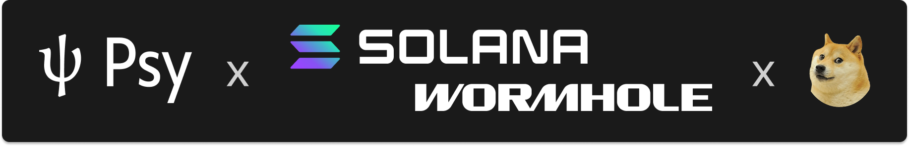
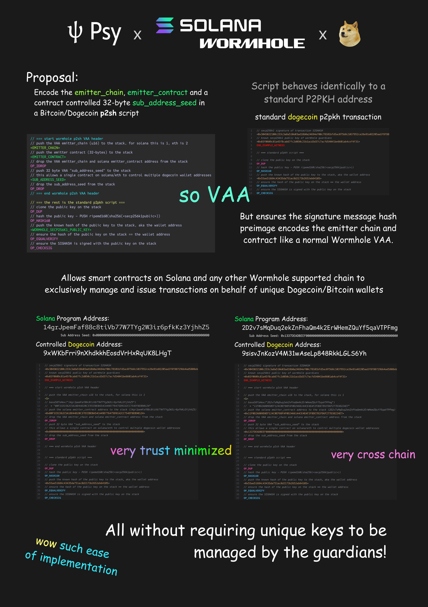

<p align="center" width="100%">
    <a href="https://psy.xyz"></a>
</p>

# Psy x Wormhole: VAA-P2SH Dogecoin Bridge

[](https://opensource.org/licenses/MIT)

This repository contains the official Rust implementation of the **VAA Pay-to-Script-Hash (VAA-P2SH)** protocol, a collaboration between [Psy Protocol](https://psy.xyz), [Wormhole](https://wormhole.com/) and [Solana](https://solana.com/) to bridge Dogecoin to the Solana ecosystem.

This library provides the core logic for Wormhole Guardians to securely manage Dogecoin funds on behalf of smart contracts on other chains, using a novel, trust-minimized, and highly scalable approach.

## Key Features

*   **Trust-Minimized Security:** Instead of managing millions of keys, Wormhole Guardians use a single Threshold Signature Scheme (TSS) key set to secure all funds. The bridge logic is enforced by the Dogecoin network itself via a custom script.
*   **Cryptographic Fund Segregation:** The protocol cryptographically links every Dogecoin P2SH address to a specific originating smart contract. It is impossible for funds controlled by one contract to be spent by an instruction from another.
*   **Infinite Scalability:** A single smart contract on Solana can generate and control a virtually unlimited number of unique Dogecoin wallets, perfect for exchanges and other large-scale applications.
*   **Pure Rust Implementation:** Built in Rust for performance, memory safety, and reliability.

## How It Works

The core innovation is a custom Dogecoin `redeemScript` that embeds Wormhole VAA metadata (the source chain and source smart contract address) directly into the script's contents.

A VAA-P2SH address is a standard P2SH address, but its `redeemScript` looks like this:

```
// VAA Header (unspendable opcodes to embed data in the script hash)
<emitter_chain> <emitter_contract> OP_2DROP <sub_address_seed> OP_DROP

// Standard P2PKH Check
OP_DUP OP_HASH160 <guardian_tss_pubkey_hash> OP_EQUALVERIFY OP_CHECKSIG
```

When Wormhole Guardians sign a transaction to spend funds from such an address, the signature hash they sign is calculated over a preimage that includes this `redeemScript`. This means their signature is a cryptographic proof that they are acting on an instruction from the specific `emitter_contract` encoded in the address.

<p align="center" width="100%">
    <a href="https://psy.xyz"></a>
</p>

For a deep dive into the cryptographic guarantees and mechanics, please see [Protocol.md](Protocol.md).


## Codebase Structure

The project is organized into several logical modules:

*   `dogecoin/`: Contains pure data structures and functions for Dogecoin primitives like transactions, addresses, constants, and hashing. This module has no networking or external dependencies.
*   `wormhole/`: The core logic for the VAA-P2SH protocol.
    *   `p2sh_vaa.rs`: Defines the VAA message structure and validation logic.
    *   `script_template.rs`: Contains the logic for constructing the custom VAA-P2SH script.
    *   `guardian_processor.rs`: The main entry point that orchestrates VAA validation, signing, and transaction creation.
    *   `tss_signer.rs`: Defines the traits for integrating a Threshold Signature Scheme.
*   `secp256k1/`: Utilities for handling secp256k1 keys and signatures. The `signer.rs` file provides a simple in-memory signer used for examples and testing.
*   `psy_doge_link/`: An asynchronous client for interacting with a Dogecoin Electrs RPC endpoint.
*   `tx_store/`: Traits and a simple in-memory cache for fetching Dogecoin transaction data.
*   `examples/`: Contains end-to-end examples demonstrating the library's usage.

## Getting Started

### Prerequisites

*   Rust toolchain (latest stable version recommended): [https://rustup.rs/](https://rustup.rs/)

### Running the Example

This repository includes a complete, end-to-end example that simulates the entire VAA-P2SH flow on the Dogecoin testnet. The example will:
1.  Define a mock VAA from a fictional Solana contract.
2.  Calculate the corresponding VAA-P2SH address on Dogecoin testnet.
3.  Fund this address with testnet DOGE from a hardcoded faucet wallet.
4.  Wait for the funding transaction to be confirmed.
5.  Use the `WormholeGuardianProcessor` to validate the mock VAA and create a signed transaction to spend the funds.
6.  Broadcast the final spending transaction to the network.

To run the example, execute the following command from the root of the project:

```bash
cargo run --package psy-doge-bridge-wormhole --example guardian_processor_example --features "dogelink,signer,hashes"
```

You will see output detailing each step, including the P2SH address, the funding transaction ID, and the final spending transaction ID.

### Integration with a Threshold Signature Scheme (TSS)

The provided example uses a `SimpleSingleSigner` for demonstration purposes. In a production environment, this must be replaced with a robust TSS implementation. This library is designed to be agnostic to the specific TSS protocol used.

For detailed instructions on how to integrate your TSS solution, please refer to our [Integration.md](Integration.md) guide.

## License

This project is licensed under the MIT License. See the [LICENSE](README.md#license-1) file for details.

---

### License

Copyright 2025 Zero Knowledge Labs Limited, Psy Protocol (https://psy.xyz), Carter Feldman

Permission is hereby granted, free of charge, to any person obtaining a copy of this software and associated documentation files (the “Software”), to deal in the Software without restriction, including without limitation the rights to use, copy, modify, merge, publish, distribute, sublicense, and/or sell copies of the Software, and to permit persons to whom the Software is furnished to do so, subject to the following conditions:

The above copyright notice and this permission notice shall be included in all copies or substantial portions of the Software.

THE SOFTWARE IS PROVIDED “AS IS”, WITHOUT WARRANTY OF ANY KIND, EXPRESS OR IMPLIED, INCLUDING BUT NOT LIMITED TO THE WARRANTIES OF MERCHANTABILITY, FITNESS FOR A PARTICULAR PURPOSE AND NONINFRINGEMENT. IN NO EVENT SHALL THE AUTHORS OR COPYRIGHT HOLDERS BE LIABLE FOR ANY CLAIM, DAMAGES OR OTHER LIABILITY, WHETHER IN AN ACTION OF CONTRACT, TORT OR OTHERWISE, ARISING FROM, OUT OF OR IN CONNECTION WITH THE SOFTWARE OR THE USE OR OTHER DEALINGS IN THE SOFTWARE.
